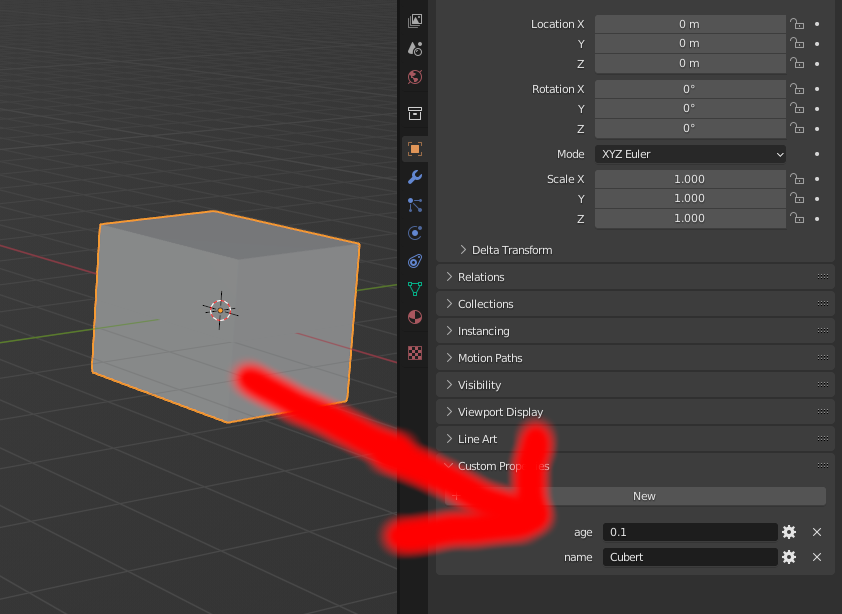
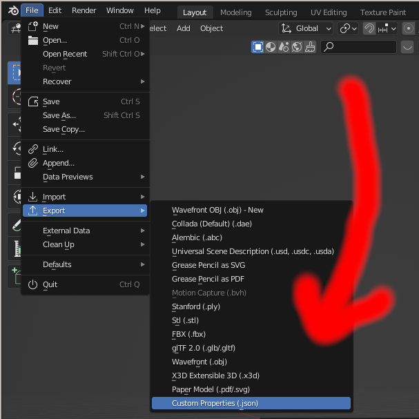

# Blender Custom Properties Exporter
## [Download .zip](https://github.com/sjkillen/blender-export-custom-properties/releases/download/0.01/export-scene-custom-props-blender-addon.zip)
<a href='https://ko-fi.com/I2I57UQ7M' target='_blank'></a>


Export objects' custom properties as a JSON file

## Example




```json
[
    {
        "type": "Scene",
        "name": "Scene",
        "data": [
            {
                "type": "Object",
                "name": "Cube",
                "data": [
                    [
                        "age",
                        "0.1"
                    ],
                    [
                        "name",
                        "Cubert"
                    ]
                ]
            }
        ]
    }
]
```

# Limitations
- Only exports things found in scene.objects
- Data is always converted to a string
- Pull request welcome :)
